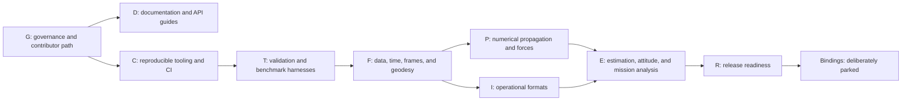

# External review improvement roadmap

This checklist turns the July 2026 external review into ordered, verifiable
work. It complements the capability milestones in `ROADMAP.md`; it does not
replace the evidence requirements in `PARITY.md`.

## Status rules

- A checked item has repository evidence linked in this file.
- An unchecked item is not complete, even if a type or prototype exists.
- Scientific items advance only as vertical slices: contract, implementation,
  tests, documentation, provenance, and an honest parity-ledger update.
- Binding feature work is parked until the Rust core stabilization gate below.
- Community actions requiring a maintainer account or policy decision remain
  explicitly owner-operated rather than being simulated by repository files.

## Review corrections and completed baseline

The review was useful but some observations were stale when received. These
items need no duplicate implementation:

- [x] **B00 — Two-body propagation exists.** The feature-gated
  `EllipticKeplerPropagator` preserves Cartesian, circular, Keplerian, and
  equinoctial representations; evidence is recorded in task 0026 and the
  propagation rows of `PARITY.md`.
- [x] **B01 — Architecture documentation exists.** `ARCHITECTURE.md` defines
  dependency direction and domain boundaries. A rendered dependency diagram
  remains D10 below.
- [x] **B02 — Linux CI exists.** `.github/workflows/build.yml` runs format,
  check, Clippy, nextest, doctests, and docs. Cross-platform, coverage,
  scheduled benchmarks, dependency policy, and MSRV coverage remain C10–C14.
- [x] **B03 — Issue templates exist.** Bug, capability, and provenance forms
  live under `.github/ISSUE_TEMPLATE`. A pull-request template and newcomer
  issue guidance remain G10–G12.
- [x] **B04 — Error types already use a coherent domain pattern.** Public
  recoverable failures are typed and use `thiserror` where formatting/source
  derivation is useful. Q10 keeps this as an audited policy rather than a
  mechanical rewrite.
- [x] **B05 — Benchmarks exist but are incomplete.** OEM and two-body/OD
  workloads provide initial evidence. A maintained regression harness and
  published methodology remain T10–T12.

## Dependency order

Items within a phase may run in parallel unless their dependency field says
otherwise. `Wave 1` is the first implementation batch created from this review.

## G — Governance and contribution path

- [x] **G10 (Wave 1, no dependency):** add a pull-request template that links
  the parity, provenance, and validation expectations without requiring every
  checkbox for documentation-only changes.
- [x] **G11 (Wave 1, depends on G10):** add a non-Rust/scientific-contributor
  guide covering standards research, reference vectors, data licensing, and
  review-only contributions.
- [x] **G12 (Wave 1, depends on G10):** document how maintainers curate and
  label `good first issue` and `help wanted` candidates; repository files can
  provide issue content, while applying hosted labels is owner-operated.
- [ ] **G13 (owner-operated):** select and publish a real-time community venue
  only when maintainers can moderate it; do not add a dead Discord/Slack/Zulip
  badge.
- [ ] **G14 (owner-operated, depends on meaningful releases):** publish design
  articles and coordinate parity validation with the Orekit community.

## C — Reproducible developer tooling and CI

- [x] **C10 (Wave 1, no dependency):** provide a task runner with discoverable
  `check`, `test`, `docs`, and `bench` commands while retaining raw Cargo
  commands in contributor documentation.
- [x] **C11 (Wave 1, no dependency):** add VS Code recommendations/settings
  that follow the pinned toolchain without overriding user preferences.
- [x] **C12 (Wave 1, no dependency):** add a minimal dev-container/Codespaces
  definition with Rust 1.96.1, rustfmt, Clippy, and cargo-nextest.
- [ ] **C13 (depends on C10):** expand CI to Linux, macOS, and Windows with a
  cost-conscious matrix and retain the full locked check suite.
- [ ] **C14 (depends on C13):** add explicit MSRV, dependency-license/advisory,
  documentation publication, and coverage jobs with documented failure and
  secret policies.
- [ ] **C15 (depends on T10):** run reproducible scheduled benchmarks without
  treating noisy timing changes as correctness failures.

## D — Architecture, tutorials, and API documentation

- [x] **D10 (Wave 1, depends on B01):** add a maintained Mermaid crate/layer
  diagram generated from or checked against Cargo metadata.
- [x] **D11 (Wave 1, depends on B00):** write a complete two-body propagation
  tutorial with explicit epoch, inertial frame, gravity source, units, valid
  elliptic regime, and error handling.
- [x] **D12 (Wave 1, depends on B00):** write an orbit-determination tutorial
  using the current Cartesian observation boundary and naming its limitations.
- [x] **D13 (Wave 1, depends on D10):** write an API guide for implementing a
  custom `Propagator<State>` and `PropagationState<Problem>` pair.
- [ ] **D14 (depends on D11–D13):** add focused rustdoc examples to public core,
  dynamics, orbits, and orbit-determination APIs where usage is non-obvious.
- [ ] **D15 (depends on stabilized corresponding APIs):** publish an Orekit
  migration guide mapping workflows and concepts, not Java classes one-for-one.

## T — Testing, validation, and performance evidence

- [x] **T10 (Wave 1, depends on C10):** establish a maintained benchmark
  harness and methodology for existing OEM, two-body, and OD workloads,
  including accuracy checks and reproducibility metadata.
- [x] **T11 (Wave 1, no dependency):** add deterministic property/invariant
  coverage for supported frame composition/inversion, orbit representation
  round trips, two-body conservation, and symmetric instantaneous range where
  each current contract makes the property meaningful.
- [x] **T12 (depends on T10):** record baseline results and regression-review
  policy without claiming cross-machine timing thresholds.
- [ ] **T13 (depends on each format/model slice):** grow provenance-cleared
  real-world conformance and scenario data for formats, propagation, frames,
  and estimation.
- [ ] **T14 (depends on parsers):** add bounded fuzz targets for untrusted file
  formats and preserve every discovered failure as a regression test.

## Q — Rust API quality audit

- [x] **Q10 (Wave 1, no dependency):** document and enforce the domain-error
  policy; audit source chaining and recoverable failure paths rather than
  replacing already-consistent enums mechanically.
- [x] **Q11 (Wave 1, no dependency):** audit `#[non_exhaustive]` case by case.
  Retain it for genuine extension/versioning boundaries and remove it only
  where a closed physical set and downstream exhaustive matching are intended.
- [x] **Q12 (Wave 1, no dependency):** audit `#[must_use]` on constructors,
  transformations, and owned-result getters where discarding the value is
  likely a bug.
- [x] **Q13 (Wave 1, no dependency):** reduce repeated trait bounds with stable
  Rust super-traits or helper traits only where this improves diagnostics.
  Rust trait aliases are unstable and are not an implementation option.
- [ ] **Q14 (depends on all feature additions):** define and test a deliberate
  feature matrix; avoid attempting every mathematical feature combination.

## F — Foundational scientific context

- [ ] **F10 (depends on T11):** validate Hifitime scale round trips and leap
  boundaries against authoritative vectors without wrapping its public API.
- [ ] **F11 (depends on T13):** implement explicit version/checksum/coverage
  contracts for caller-selected scientific datasets and deterministic offline
  use.
- [ ] **F12 (depends on F10–F11):** implement Earth-orientation-backed inertial
  and terrestrial frame transforms with composition/inverse evidence.
- [ ] **F13 (depends on F11):** add reference ellipsoids, geodetic conversions,
  and local topocentric frames with standard vectors and singularity policy.
- [ ] **F14 (depends on F11):** add caller-selected physical ephemeris providers
  with explicit coverage and interpolation errors.

## P — Propagation, force models, events, and attitude

- [x] **P10 (Wave 1 design slice; depends on T11):** specify the minimal
  numerical propagation vertical slice, including coupled-state boundaries,
  typed tolerances, dense output, events, and validation scenarios.
- [x] **P11 (depends on P10):** implement an adaptive embedded Runge–Kutta
  integrator and a frame/epoch-qualified numerical propagator with documented
  local/global error behavior. Evidence: task 0036 and
  `crates/dynamics/numerical`.
- [x] **P12 (depends on P11):** implement dense ephemerides, root localization,
  event direction, handlers, and deterministic simultaneous-event policy.
  Evidence: task 0037 and `crates/dynamics/numerical`.
- [ ] **P13 (depends on F14 and P11):** add third-body point-mass gravity.
- [ ] **P14 (depends on F11–F14 and P11):** add harmonics/tides, drag and
  atmosphere, radiation pressure, and relativity as separately evidenced
  vertical slices.
- [ ] **P15 (depends on P11–P12):** add spacecraft mass evolution and
  impulsive/finite maneuvers.
- [ ] **P16 (depends on attitude providers and P11):** add attitude dynamics,
  interpolation, and attitude-dependent force evaluation.
- [ ] **P17 (depends on P11):** add variational equations, STM, and covariance
  propagation with finite-difference or analytic sensitivity evidence.

## I — Operational formats and data ingestion

- [ ] **I10 (depends on T13–T14):** add CCSDS OEM XML read support while
  preserving the current bounded streaming semantics and semantic model.
- [ ] **I11 (depends on I10):** add lossless OEM writing and KVN/XML semantic
  round trips.
- [ ] **I12 (depends on T13–T14):** add OPM, OMM, and OCM incrementally, then
  attitude and tracking message families, each with its own conformance corpus.
- [ ] **I13 (depends on F10):** add strict TLE parsing/formatting with standard
  checksum and malformed-input cases.
- [ ] **I14 (depends on I13 and P10):** implement independently validated SGP4
  behavior using published standards and verification cases.
- [ ] **I15 (depends on F11–F14):** add SP3, RINEX, gravity-field, EOP,
  ephemeris, and space-weather ingestion as separate bounded parser slices.

## E — Estimation and mission workflows

- [ ] **E10 (depends on F12–F14):** complete participant clocks, weather,
  displacement, GNSS, inter-satellite, and higher-order signal paths.
- [ ] **E11 (depends on P17):** add parameter drivers, measurement generation,
  correlated covariance ingestion, and batch least squares.
- [ ] **E12 (depends on F12–F14 and P12):** implement visibility, eclipse,
  occultation, field-of-view, and access workflows with edge-case scenarios.
- [ ] **E13 (depends on P11, I/O as needed):** add end-to-end real-world
  scenarios that ingest, propagate, observe, estimate, and report residuals.

## R — Packaging, releases, and adoption

- [x] **R10 (Wave 1, no dependency):** add a changelog and document pre-1.0
  semantic-versioning and release-note policy for Rust crates.
- [ ] **R11 (depends on validated facade workflows):** prepare crates.io
  metadata/publishing order and a dry-run checklist; do not publish from CI
  without an explicit maintainer release.
- [ ] **R12 (depends on R11):** publish versioned documentation and evidence
  bundles for releases.
- [ ] **R13 (owner-operated, depends on project identity decision):** create a
  logo/branding package with confirmed rights and maintainer approval.

## Parked — Python and JVM bindings

No binding feature, packaging, smoke-test, or FFI-stability work is active in
this program. It resumes only after maintainers declare the Rust facade and the
underlying numerical/data contracts stable enough to version. Until then,
binding edits are limited to preserving compilation if a core change requires
it, as stated in `AGENTS.md` and task 0022.

## Wave 1 completion record

Agents should implement Wave 1 items on isolated branches/worktrees. The
integration owner checks items here only after reviewing the commit, merging
it, and running the relevant checks.

| Track | Branch | Evidence | Status |
| --- | --- | --- | --- |
| Governance, DX, docs, release policy | `codex/review-docs-dx` | `455b861`; task 0034 | Complete |
| Validation and benchmarks | `codex/review-validation` | `8a30211`; task 0035 | Complete |
| Rust API quality and numerical-propagation design | `codex/review-core-quality` | `f337e8e`; task 0033; ADR-0037 | Complete |
