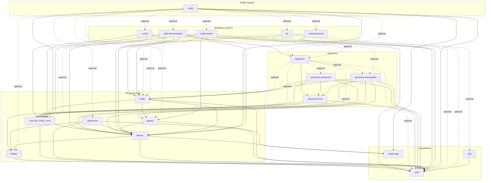

# Current Rust crate architecture

This diagram describes the checked-in Cargo workspace, not the complete target
architecture. It is generated from normal path dependencies returned by
`cargo metadata --format-version 1 --no-deps --locked`; development-only
dependencies are omitted and optional dependencies use dashed arrows.

Dependencies point from a consumer to the crate it uses. The layer groupings
are maintained in `scripts/check_crate_diagram.ps1`; the script fails when a
workspace package has not been assigned to a layer. Run `just diagram` after
a manifest change and `just diagram-check` in review. Both commands use the
locked dependency graph.

The graph is descriptive. The normative dependency direction and the meaning
of each domain boundary remain in [the target architecture](../.agent/ARCHITECTURE.md).
In particular, the feature-gated `dynamics` and `orskit` facades point inward
to implementations because they curate exports; this does not permit a
physical-model crate to depend upward on either facade.
